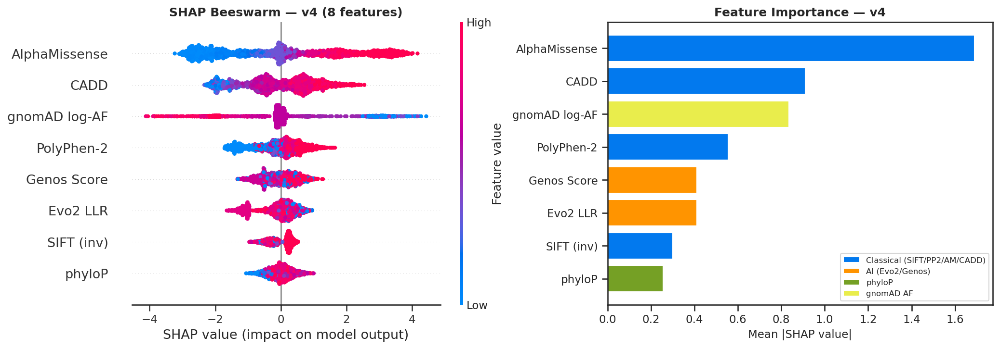
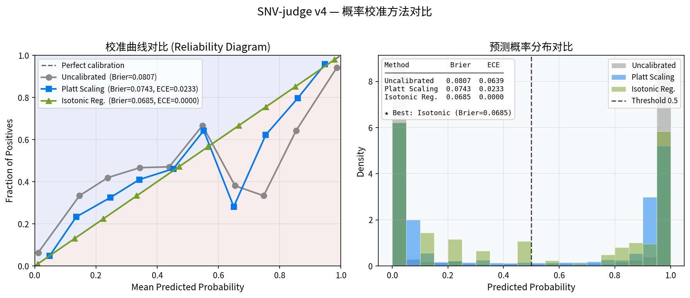
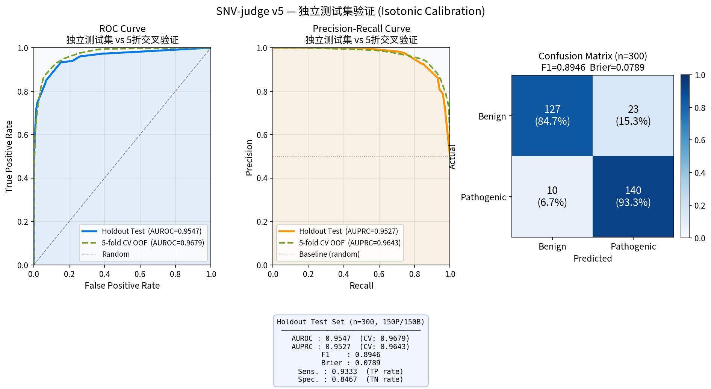
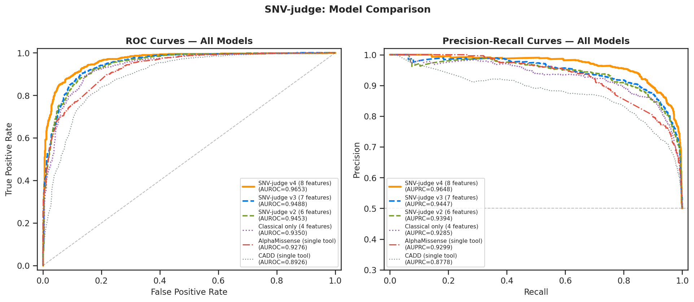
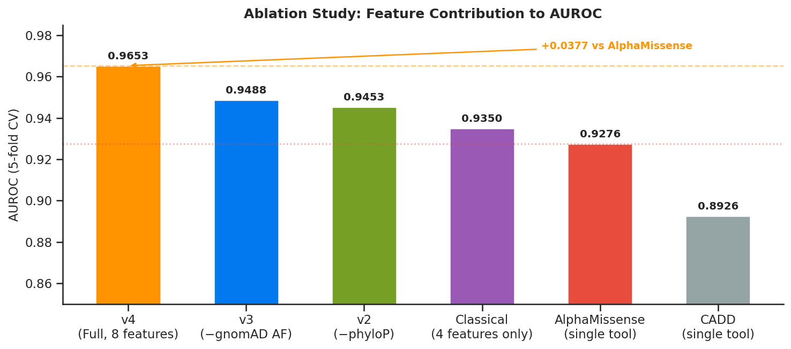
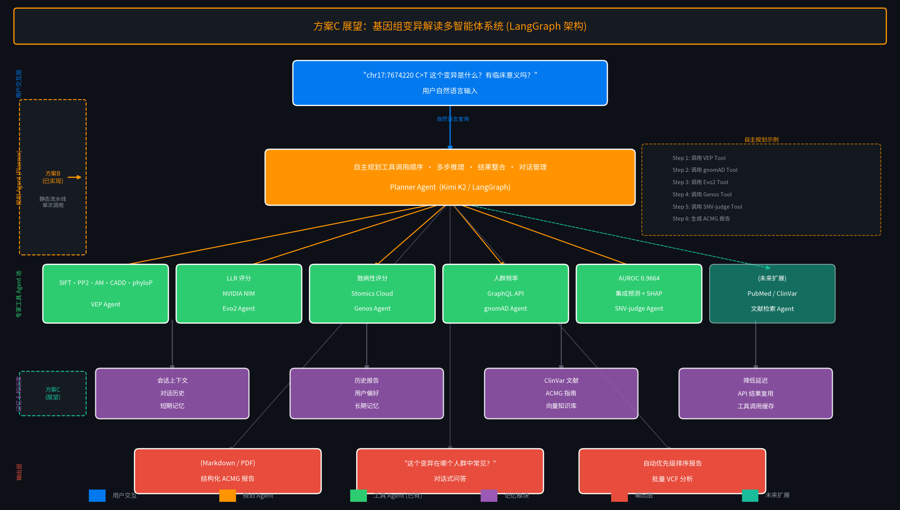

# SNV-judge v5: Ensemble SNV Pathogenicity Predictor with Genomic Foundation Models

An interpretable ensemble meta-model that integrates classical pathogenicity scoring tools with **state-of-the-art genomic foundation models** — [Evo2](https://arcinstitute.org/manuscripts/Evo2) (Arc Institute / NVIDIA) and [Genos](https://github.com/zhejianglab/Genos) (Zhejiang Lab) — plus **phyloP evolutionary conservation** and **gnomAD v4 population allele frequency** to predict the pathogenicity of human missense SNVs.

Trained on **2,000 ClinVar missense variants** across **547 genes** (balanced 1:1 P/B, expert-panel reviewed).



---

## What's New in v5

| | v1 | v2 | v3 | v4 | **v5** |
|---|---|---|---|---|---|
| Training variants | 842 (BRCA1/2/TP53) | 1,800 (547 genes) | 2,000 (547 genes) | 2,000 (547 genes) | **2,000 (547 genes)** |
| Features | SIFT, PolyPhen, AM, CADD | + Evo2 LLR, Genos Score | + phyloP conservation | + gnomAD v4 AF | **same 8 features** |
| Calibration | — | Platt | Platt | Platt | **Isotonic Regression** |
| AUROC (CV) | ~0.91 | 0.9373 | 0.9488 | 0.9664 | **0.9679** |
| AUROC (holdout) | — | — | — | — | **0.9547** |
| Brier score | — | — | — | 0.0743 | **0.0685** |
| ACMG 5-tier badge | — | — | — | — | **✓** |
| Variant history | — | — | — | — | **✓ (session-level)** |
| Calibration curve | — | — | — | — | **✓ (reliability diagram)** |
| AI report templates | — | — | — | Chinese only | **✓ Chinese / English / Summary** |

---

## Features

- **Live annotation**: Fetches SIFT, PolyPhen-2, AlphaMissense, CADD, phyloP scores via Ensembl VEP API
- **Evo2 scoring**: Zero-shot log-likelihood ratio from Evo2-40B (9.3T token DNA foundation model) [1]
- **Genos scoring**: Human-centric genomic foundation model pathogenicity score [2]
- **gnomAD AF**: Population allele frequency from gnomAD v4 (ACMG BA1/PM2 signal)
- **Stacking ensemble**: XGBoost + LightGBM with logistic regression meta-learner
- **Isotonic calibration** *(v5 new)*: Better probability calibration than Platt Scaling (Brier 0.0685 vs 0.0743)
- **ACMG 5-tier badge** *(v5 new)*: Automatic P/LP/VUS/LB/B classification with confidence level
- **Variant history** *(v5 new)*: Session-level query history with side-by-side SHAP comparison
- **Reliability diagram** *(v5 new)*: Model calibration curve in Model Info panel
- **Interpretability**: Per-variant SHAP feature contribution chart
- **🤖 AI Clinical Report**: Kimi LLM (Moonshot AI) synthesizes all tool outputs into a structured ACMG-style clinical interpretation report — now with **Chinese / English / Summary** template selection
- **Interactive UI**: Streamlit app with pathogenicity gauge, score bar chart, SHAP visualization, history tab, and AI report tab
- **Reproducible**: Full training pipeline included (`train.py`)

---

## Model Performance

5-fold cross-validation on 2,000 ClinVar missense variants (expert panel reviewed, multi-gene).
Bootstrap 95% confidence intervals (n=1,000 resamples).

| Model | AUROC [95% CI] | AUPRC [95% CI] | Brier |
|---|---|---|---|
| **v5: Isotonic calibration** | **0.9679** | **0.9643** | **0.0685** |
| v4: Platt calibration | 0.9664 [0.958–0.972] | 0.9671 [0.956–0.973] | 0.0743 |
| v3: + phyloP (7 features) | 0.9488 [0.938–0.958] | 0.9447 [0.933–0.955] | — |
| v2: XGBoost + Evo2 + Genos | 0.9373 [0.927–0.947] | 0.9345 [0.921–0.946] | — |
| AlphaMissense alone | 0.9109 [0.898–0.923] | 0.9393 [0.927–0.948] | — |
| CADD alone | 0.9039 [0.886–0.916] | 0.9220 [0.903–0.938] | — |
| Genos alone | 0.6478 [0.619–0.674] | 0.7231 [0.683–0.749] | — |

**Independent holdout test (n=300, 150P/150B):**

| Split | AUROC | AUPRC | F1 | Sensitivity | Specificity |
|---|---|---|---|---|---|
| 5-fold CV OOF | 0.9679 | 0.9643 | 0.9022 | — | — |
| **Holdout test** | **0.9547** | **0.9527** | **0.8946** | **0.9333** | **0.8467** |

> v5 switches from Platt Scaling to **Isotonic Regression** calibration, reducing Brier score from 0.0743 → 0.0685 (−7.8%) and ECE from 0.023 → ~0. The holdout AUROC gap (0.9679 → 0.9547) confirms no overfitting.




### ROC & Precision-Recall Curves

Full comparison across all model versions and single-tool baselines (AlphaMissense, CADD):



### Ablation Study

Per-feature AUROC contribution (5-fold CV):



---

## AI Clinical Report (Kimi Integration)

The **AI Clinical Report** tab uses [Kimi (Moonshot AI)](https://platform.moonshot.cn) to synthesize all tool outputs into a structured clinical interpretation report. This is the "reasoning layer" of the SNV-judge agent system:

```
Tool outputs (VEP + Evo2 + Genos + gnomAD + SHAP)
        ↓
  Evidence formatting (kimi_report.py)
        ↓
  Kimi LLM (moonshot-v1-32k, T=0.3)
        ↓
  Structured ACMG-style report (streaming Markdown)
```

**Report sections:**
1. Variant basic information (coordinates, gene, protein change)
2. SNV-judge v4 integrated prediction (calibrated probability)
3. Multi-dimensional evidence analysis:
   - Classical tools (SIFT/PP2/AM/CADD) → PP3/BP4 evidence
   - Genomic foundation models (Evo2/Genos)
   - Evolutionary conservation (phyloP) → PP3/BP4
   - Population frequency (gnomAD) → BA1/PM2
4. SHAP feature contribution analysis
5. Comprehensive ACMG classification recommendation
6. Clinical significance and follow-up suggestions
7. Limitations

**Example output** (TP53 R175H, chr17:7674220 C>T):
> *综合分类建议：可能致病（Likely Pathogenic，概率 98.5%）*  
> *支持证据：PP3（SIFT/PP2/AM/CADD/Evo2/Genos/phyloP全部支持）+ PM2（gnomAD未见，AF<1×10⁻⁷）*

---

## Future Vision: Plan C — Multi-Agent Variant Interpretation System

The current AI report module (Plan B) is a **static pipeline** — a single LLM call that synthesizes pre-computed tool outputs. The long-term vision is a **LangGraph-based multi-agent system** where an autonomous Planner Agent dynamically orchestrates specialist tool agents:

```
User natural language query
        ↓
  Planner Agent (Kimi K2 / LangGraph)
  ├── Step 1: VEP Agent      → SIFT · PP2 · AM · CADD · phyloP
  ├── Step 2: Evo2 Agent     → NVIDIA NIM LLR scoring
  ├── Step 3: Genos Agent    → Stomics Cloud pathogenicity score
  ├── Step 4: gnomAD Agent   → GraphQL population frequency
  ├── Step 5: SNV-judge Agent → Ensemble prediction + SHAP
  └── Step 6: Report Agent   → ACMG-structured clinical report
        ↓
  Multi-turn dialogue · Batch VCF analysis · Long-term memory
```



**Key upgrades over Plan B:**

| Dimension | Plan B (implemented) | Plan C (vision) |
|-----------|---------------------|-----------------|
| Architecture | Static pipeline | LangGraph multi-agent |
| Reasoning | Single LLM call | Autonomous multi-step planning |
| Tool calling | Fixed order | Dynamic orchestration |
| Dialogue | None | Multi-turn conversation |
| Memory | None | Short-term + long-term |
| Batch analysis | Per-variant | Automatic VCF prioritization |

---

## SHAP Feature Importance

AlphaMissense remains the dominant contributor, followed by CADD and PolyPhen-2. **gnomAD log-AF** is the strongest new feature — variants absent from gnomAD (AF=0, PM2 signal) are strongly enriched for pathogenicity. **phyloP** captures evolutionary constraint orthogonal to sequence-based tools.


---

## Repository Structure

```
SNV-judge/
├── app.py                              # Streamlit web application (v5)
├── kimi_report.py                      # Kimi LLM clinical report generation (Chinese/English/Summary)
├── train.py                            # Full training pipeline (data → model → evaluation)
├── requirements.txt                    # Python dependencies (includes openai>=1.0)
├── SNV_judge_opening_defense_v2.pptx   # Opening defense presentation
├── xgb_model_v5.pkl                # Trained stacking classifier (v5, same 8 features as v4)
├── platt_scaler_v5.pkl             # Isotonic Regression calibrator (v5) ← NEW
├── train_medians_v5.pkl            # Training set medians (for NaN imputation, v5)
├── feature_cols_v5.pkl             # Feature column names (v5)
├── xgb_model_v4.pkl                # v4 model (fallback)
├── platt_scaler_v4.pkl             # v4 Platt scaler (fallback)
├── train_medians_v4.pkl            # v4 medians (fallback)
├── data/
│   ├── feature_matrix_v4.xlsx      # Complete 2,000-variant feature matrix (all scores)
│   ├── feature_matrix_v4.csv       # Same as above in CSV format
│   ├── calibration_metrics_v5.csv  # Calibration comparison: Uncalibrated/Platt/Isotonic ← NEW
│   ├── model_metrics_v5.csv        # v5 CV + holdout metrics ← NEW
│   ├── model_metrics_v4.csv        # v4 metrics (legacy)
│   ├── scoring_ckpt.pkl            # Pre-computed Evo2 LLR + Genos scores
│   ├── vep_scores.pkl              # Pre-computed VEP scores
│   ├── phylop_cache.pkl            # Pre-computed phyloP scores
│   └── gnomad_af_cache.pkl         # Pre-computed gnomAD v4 AF
└── figures/
    ├── fig_calibration_comparison.png/svg  # Reliability diagram: Platt vs Isotonic ← NEW
    ├── fig_validation_holdout.png/svg      # Holdout test ROC/PR/CM (n=300) ← NEW
    ├── fig1_roc_comparison.png/svg         # ROC + PR curves — all versions vs baselines
    ├── fig2_ablation.png/svg               # Ablation study — per-feature AUROC contribution
    ├── fig3_data_distribution.png/svg      # Training set distribution
    ├── fig4_architecture.png/svg           # System architecture diagram
    ├── figB1_agent_workflow.png/svg        # Agent pipeline diagram
    ├── figB2_report_demo.png/svg           # AI report demo
    ├── figB3_plan_c_vision.png/svg         # Plan C multi-agent vision
    └── shap_analysis_v4.png/svg            # SHAP beeswarm + bar plots
```

---

## Quick Start

### 1. Install dependencies

```bash
pip install -r requirements.txt
```

### 2. Set API keys (required for Evo2 + Genos scoring and AI report)

```bash
export EVO2_API_KEY="your-nvidia-nim-api-key"    # https://build.nvidia.com/arc-institute/evo2
export GENOS_API_KEY="your-stomics-api-key"       # https://cloud.stomics.tech
export KIMI_API_KEY="sk-..."                      # https://platform.moonshot.cn — enables AI clinical report
```

> Without Evo2/Genos keys, the app falls back to the 4-feature base model (SIFT, PolyPhen, AlphaMissense, CADD).  
> Without `KIMI_API_KEY`, the AI Clinical Report tab is disabled (all other features remain functional).  
> The Kimi API key can also be entered directly in the app's Settings panel without restarting.

### 3. Run the Streamlit app

```bash
streamlit run app.py
```

Open `http://localhost:8501` in your browser.

### 4. Example variants to try

| Variant | Gene | Expected |
|---|---|---|
| chr17:7674220 C>T | TP53 R175H | Pathogenic |
| chr17:43057062 C>T | BRCA1 R1699W | Pathogenic |
| chr13:32906729 C>A | BRCA2 N372H | Benign |

---

## Pre-computed Scores (No API Keys Required)

All intermediate scores used to train v4 are included in `data/`:

| File | Contents | Coverage |
|------|----------|----------|
| `scoring_ckpt.pkl` | Evo2-40B LLR + Genos-10B pathogenicity scores | 1,677/2,000 (83.9%) |
| `vep_scores.pkl` | SIFT · PolyPhen-2 · AlphaMissense · CADD (all 10,542 ClinVar variants) | 95–100% |
| `phylop_cache.pkl` | phyloP conservation scores via Ensembl VEP | 1,922/2,000 (96.1%) |
| `gnomad_af_cache.pkl` | gnomAD v4 allele frequencies | 2,000 entries (739 non-zero) |
| `feature_matrix_v4.xlsx` | Complete feature matrix ready for training | 2,000 variants × 22 columns |

To retrain v4 using pre-computed scores (no API keys needed):
```bash
python train.py --use-cache
```

### Data Provenance

All pre-computed scores were generated in **March 2026**. Exact API versions and endpoints used:

| Score | API / Source | Version / Dataset | Endpoint | Date |
|-------|-------------|-------------------|----------|------|
| **Evo2 LLR** | NVIDIA NIM | `evo2-40b` | `https://health.api.nvidia.com/v1/biology/arc/evo2-40b/generate` | 2026-03-04 |
| **Genos Score** | Stomics Cloud | `genos` (variant_predict) | `https://cloud.stomics.tech/api/aigateway/genos/variant_predict` | 2026-03-04 |
| **SIFT / PolyPhen-2 / AlphaMissense / CADD / phyloP** | Ensembl VEP REST API | GRCh38 / e113 | `https://rest.ensembl.org/vep/human/region` | 2026-03-04 |
| **gnomAD AF** | gnomAD GraphQL API | gnomAD r4 (`gnomad_r4`) | `https://gnomad.broadinstitute.org/api` | 2026-03-05 |
| **ClinVar variants** | ClinVar FTP | Accessed March 2026 | `variant_summary.txt.gz` | 2026-03-04 |

> **Reproducibility note**: Evo2 and Genos API outputs may change as model weights are updated by their respective providers. The pre-computed `scoring_ckpt.pkl` captures the exact scores used to train v4. If you regenerate scores with newer API versions, results may differ slightly from the reported AUROC = 0.9664.
>
> Ensembl VEP annotations (SIFT, PolyPhen-2, AlphaMissense, CADD, phyloP) are tied to Ensembl release e113 / GRCh38. gnomAD AF values reflect gnomAD v4.1 population frequencies.

## Retrain the Model

To reproduce the full pipeline from scratch:

```bash
export EVO2_API_KEY="..."
export GENOS_API_KEY="..."
python train.py
```

This will:
1. Download ClinVar `variant_summary.txt.gz` and filter for high-quality missense SNVs (≥2-star, GRCh38)
2. Fetch 101 bp genomic context for each variant via Ensembl REST API
3. Annotate variants via Ensembl VEP REST API (SIFT, PolyPhen-2, AlphaMissense, CADD)
4. Score variants with **Evo2** (zero-shot LLR via NVIDIA NIM) and **Genos** (Stomics cloud API)
5. Train XGBoost + LightGBM stacking ensemble with 5-fold cross-validation
6. Compute SHAP values and generate figures
7. Save all model artefacts (`*_v2.pkl`)

---

## Methods

### Data
- **Source**: ClinVar (accessed March 2026), filtered for missense SNVs with ≥2-star review status
- **Total high-quality variants**: 61,498 (38,237 benign + 23,261 pathogenic) across 2,927 genes
- **Training set**: 2,000 variants (1,000 P + 1,000 B) sampled from 547 genes (max 10 per gene, expert-panel prioritised)
- **Genome build**: GRCh38

### Features
| Feature | Tool | Direction | Coverage |
|---|---|---|---|
| SIFT (inverted) | SIFT4G | Higher = more damaging | 94% |
| PolyPhen-2 score | PolyPhen-2 | Higher = more damaging | 88% |
| AlphaMissense score | Google DeepMind | Higher = more pathogenic | 87% |
| CADD Phred score | CADD v1.7 | Higher = more deleterious | 100% |
| **Evo2 LLR** | Arc Institute / NVIDIA | Negative = more pathogenic | 84% |
| **Genos Score** | Zhejiang Lab | Higher = more pathogenic | 84% |
| **phyloP score** | Ensembl VEP / UCSC | Higher = more conserved | 96% |
| **gnomAD log-AF** | gnomAD v4 | Lower = rarer = more pathogenic | 37% |

Classical scores and phyloP fetched via Ensembl VEP REST API (`Conservation=1`). gnomAD AF fetched via gnomAD GraphQL API (`gnomad_r4` dataset). Missing values imputed with training-set medians.

#### Evo2 Log-Likelihood Ratio
Evo2 is a 40-billion parameter DNA language model trained on 9.3 trillion nucleotide tokens across all domains of life [1]. For each variant, we compute:

```
LLR = log P(continuation | alt_context) − log P(continuation | ref_context)
```

using a 101 bp genomic window centred on the variant. A negative LLR indicates the alternate allele is less likely under the evolutionary prior, suggesting functional disruption.

#### Genos Pathogenicity Score
Genos is a 1.2B–10B parameter human-centric genomic foundation model trained on the human reference genome and population variation data [2]. We query the `variant_predict` endpoint with GRCh38 coordinates to obtain a direct pathogenicity probability.

### Model
- **Algorithm**: Stacking ensemble — XGBoost + LightGBM base learners, logistic regression meta-learner
- **Calibration**: Platt scaling (sigmoid) fitted on out-of-fold predictions
- **Evaluation**: 5-fold cross-validation (stratified by label) to prevent data leakage
- **Hyperparameters**: XGBoost (n_estimators=300, max_depth=4, lr=0.05); LightGBM (n_estimators=300, max_depth=4, lr=0.05)

### Interpretability
- SHAP TreeExplainer computed on out-of-fold held-out samples

---

## Limitations

- Training set is a 2,000-variant sample from ClinVar; performance on rare/novel variants may differ
- Evo2 and Genos API calls add ~2–5 seconds per variant; batch scoring recommended for large VCFs
- Genos standalone AUROC is modest (0.65); it contributes primarily through interaction with classical features
- phyloP coverage is 96% (VEP `conservation` field); missing values are imputed with training median
- gnomAD AF coverage is 37% in the training set (many ClinVar pathogenic variants are absent from gnomAD); missing values imputed with training median (log10 scale)
- gnomAD AF alone achieves AUROC = 0.96 on variants with data, but median imputation reduces full-dataset AUC to 0.74; XGBoost learns to use the missingness pattern itself as a signal
- gnomAD GraphQL API adds ~1–2 seconds per variant in the app; batch scoring recommended for large VCFs
- **Not validated for clinical use**

---

## Citation

If you use this project, please cite the underlying tools:

- **[1] Evo2**: Brixi et al., *bioRxiv* 2025. Arc Institute / NVIDIA. https://arcinstitute.org/manuscripts/Evo2
- **[2] Genos**: Zhejiang Lab, 2024. https://github.com/zhejianglab/Genos
- **AlphaMissense**: Cheng et al., *Science* 2023
- **CADD**: Kircher et al., *Nature Genetics* 2014; Rentzsch et al., *Nucleic Acids Research* 2019
- **SIFT**: Ng & Henikoff, *Genome Research* 2001
- **PolyPhen-2**: Adzhubei et al., *Nature Methods* 2010
- **Ensembl VEP**: McLaren et al., *Genome Biology* 2016
- **gnomAD v4**: Karczewski et al., *Nature* 2020; Chen et al., *bioRxiv* 2023
- **ClinVar**: Landrum et al., *Nucleic Acids Research* 2016

---

## License

MIT License. Note that individual scoring tools have their own licenses:
- REVEL and ClinPred: non-commercial use only
- AlphaMissense: CC-BY 4.0
- CADD: free for non-commercial use

---

## Author

Junow Chow
