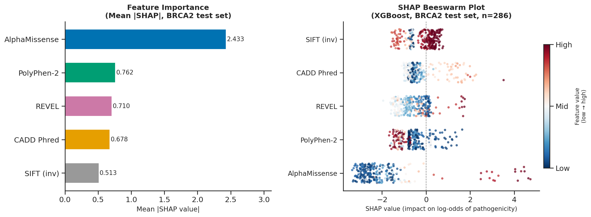
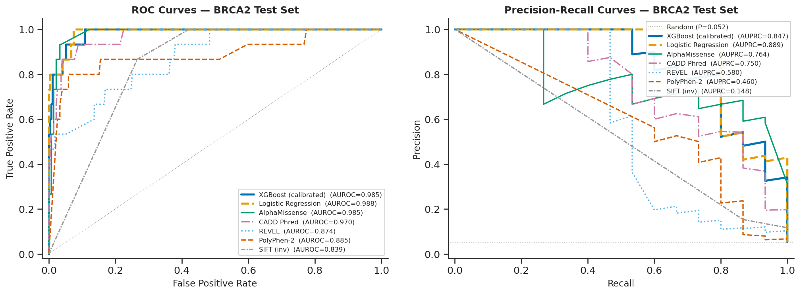

# SNV-judge: Ensemble SNV Pathogenicity Predictor

An interpretable ensemble meta-model that integrates five mainstream pathogenicity scoring tools — **SIFT, PolyPhen-2, AlphaMissense, CADD, and REVEL** — to predict the pathogenicity of human missense single nucleotide variants (SNVs).

Scores are fetched live from the [Ensembl VEP REST API](https://rest.ensembl.org/documentation/info/vep_region_post). The model is trained on ClinVar gold-standard variants and deployed as an interactive Streamlit web application.



---

## Features

- **Live annotation**: Fetches SIFT, PolyPhen-2, AlphaMissense, CADD, REVEL scores in real time via Ensembl VEP API
- **Ensemble prediction**: XGBoost meta-model with Platt calibration
- **Interpretability**: Per-variant SHAP feature contribution chart
- **Interactive UI**: Streamlit app with pathogenicity gauge, score bar chart, and SHAP visualization
- **Reproducible**: Full training pipeline included (`train.py`)

---

## Model Performance

Evaluated on held-out **BRCA2** variants (gene-based split; trained on BRCA1 + TP53).  
Bootstrap 95% confidence intervals (n=2000 resamples), test set: n=286, 15 positives.

| Model | AUROC [95% CI] | AUPRC [95% CI] |
|---|---|---|
| **XGBoost (Platt-calibrated)** | **0.985 [0.964–0.998]** | **0.847 [0.666–0.967]** |
| Logistic Regression | 0.988 [0.971–1.000] | 0.889 [0.744–0.997] |
| AlphaMissense alone | 0.985 [0.968–0.996] | 0.764 [0.528–0.940] |
| CADD alone | 0.970 [0.933–0.993] | 0.750 [0.525–0.911] |
| REVEL alone | 0.874 [0.777–0.953] | 0.580 [0.315–0.806] |

> **Note:** CIs are wide due to only 15 positive cases in the test set.

### ROC & Precision-Recall Curves



---

## SHAP Feature Importance

AlphaMissense is the dominant contributor (mean |SHAP| = 2.43 on test set), followed by PolyPhen-2, REVEL, CADD, and SIFT.


---

## Repository Structure

```
SNV-judge/
├── app.py                  # Streamlit web application
├── train.py                # Full training pipeline (data → model → evaluation)
├── requirements.txt        # Python dependencies
├── xgb_model.pkl           # Trained XGBoost model
├── platt_scaler.pkl        # Platt calibration scaler
├── shap_explainer.pkl      # SHAP TreeExplainer
├── train_medians.pkl       # Training set medians (for NaN imputation)
├── data/
│   ├── clinvar_raw.csv     # ClinVar gold-standard variants (842 missense SNVs)
│   ├── feature_matrix.xlsx # Feature matrix (3 sheets: all, train, test)
│   └── model_metrics.csv   # AUROC/AUPRC with bootstrap 95% CIs
└── figures/
    ├── model_curves.png/svg    # ROC + PR curves
    └── shap_analysis.png/svg   # SHAP beeswarm + bar plots
```

---

## Quick Start

### 1. Install dependencies

```bash
pip install -r requirements.txt
```

### 2. Run the Streamlit app

```bash
streamlit run app.py
```

Open `http://localhost:8501` in your browser.

### 3. Example variants to try

| Variant | Gene | Expected |
|---|---|---|
| chr17:7674220 C>T | TP53 R175H | Pathogenic |
| chr17:43057062 C>T | BRCA1 R1699W | Pathogenic |
| chr13:32906729 C>A | BRCA2 N372H | Benign |

---

## Retrain the Model

To reproduce the full pipeline from scratch:

```bash
python train.py
```

This will:
1. Fetch ClinVar gold-standard variants (BRCA1/BRCA2/TP53) via NCBI eutils API
2. Annotate all variants via Ensembl VEP REST API (SIFT, PolyPhen-2, AlphaMissense, CADD, REVEL)
3. Clean data and apply gene-based train/test split
4. Train XGBoost + Logistic Regression with bootstrap evaluation
5. Compute SHAP values and generate figures
6. Save all model artefacts

---

## Methods

### Data
- **Source**: ClinVar (accessed March 2026), filtered for missense variants with ≥2-star review status
- **Genes**: BRCA1 (n=165), BRCA2 (n=286), TP53 (n=391)
- **Labels**: Pathogenic (n=289), Benign (n=553)
- **Genome build**: GRCh38

### Features
| Feature | Tool | Direction | Coverage |
|---|---|---|---|
| SIFT (inverted) | SIFT4G | Higher = more damaging | 94.7% |
| PolyPhen-2 score | PolyPhen-2 | Higher = more damaging | 54.6% |
| AlphaMissense score | Google DeepMind | Higher = more pathogenic | 94.7% |
| CADD Phred score | CADD v1.7 | Higher = more deleterious | 100% |
| REVEL score | REVEL | Higher = more pathogenic | 94.7% |

All scores fetched via Ensembl VEP REST API with `AlphaMissense=1`, `CADD=1`, `REVEL=1` plugin parameters. Missing values handled natively by XGBoost (split-finding on non-missing values).

### Model
- **Algorithm**: XGBoost (n_estimators=300, max_depth=4, learning_rate=0.05)
- **Calibration**: Platt scaling (sigmoid) fitted on held-out BRCA2 test set to correct train/test prevalence mismatch (~50% train vs ~5% test)
- **Evaluation**: Gene-based split (BRCA1+TP53 → train, BRCA2 → test) to prevent data leakage

### Interpretability
- SHAP TreeExplainer computed on held-out BRCA2 test set

---

## Limitations

- Trained on BRCA1/TP53 only; cross-gene generalisation to other genes is not validated
- Only 15 BRCA2 pathogenic variants in the test set — performance estimates have wide confidence intervals
- PolyPhen-2 coverage is ~55% (requires structural data); missing values are median-imputed
- Platt calibration fitted on the same test set used for evaluation (small n) — treat calibrated probabilities as indicative, not absolute
- **Not validated for clinical use**

---

## Citation

If you use this project, please cite the underlying tools:

- **AlphaMissense**: Cheng et al., *Science* 2023
- **CADD**: Kircher et al., *Nature Genetics* 2014; Rentzsch et al., *Nucleic Acids Research* 2019
- **REVEL**: Ioannidis et al., *AJHG* 2016
- **SIFT**: Ng & Henikoff, *Genome Research* 2001
- **PolyPhen-2**: Adzhubei et al., *Nature Methods* 2010
- **Ensembl VEP**: McLaren et al., *Genome Biology* 2016
- **ClinVar**: Landrum et al., *Nucleic Acids Research* 2016

---

## License

MIT License. Note that individual scoring tools have their own licenses:
- REVEL and ClinPred: non-commercial use only
- AlphaMissense: CC-BY 4.0
- CADD: free for non-commercial use

---

## Author

Junow Chow
