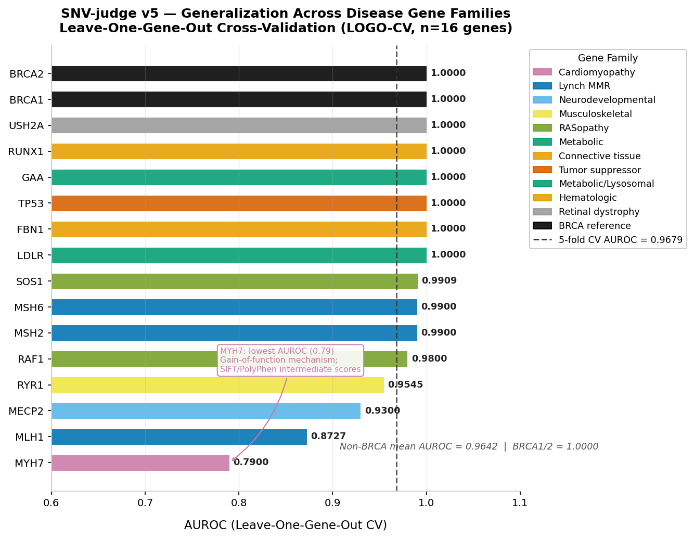

# SNV-judge v5.2：基于基因组基础模型的集成 SNV 致病性预测工具

> 🌐 语言切换：[English](README.md) | **中文**

一个可解释的集成元模型，将经典致病性评分工具与**最先进的基因组基础模型**——[Evo2](https://arcinstitute.org/manuscripts/Evo2)（Arc Institute / NVIDIA）和 [Genos](https://github.com/zhejianglab/Genos)（浙江实验室）——以及 **phyloP 进化保守性**和 **gnomAD v4 人群等位基因频率**相结合，预测人类错义 SNV 的致病性。

在 **2,000 个 ClinVar 错义变异**（547 个基因，1:1 致病/良性平衡，专家组审核）上训练。


---

## 版本更新

### v5.2（当前版本）
- **`predict.py` 离线 CLI**（`skill/scripts/predict.py`）：完整离线预测脚本，包含 18 个函数——VEP 注释、gnomAD AF、ClinVar 查询、SHAP 瀑布图、批量 VCF 评分，以及 `print_shap_summary()` 终端友好的特征贡献展示
- **Genos Embedding URL 设置**：在应用设置面板中输入本地 ngrok 端点，无需 Stomics Cloud API Key 即可使用 Genos-10B embedding 余弦距离评分（三级降级：Cloud API → 本地 embedding → 训练集中位数）
- **LOGO-CV 图表**：在模型信息面板中展示 16 个疾病基因家族的泛化性评估图

### v5.0 → v5.1

| | v1 | v2 | v3 | v4 | **v5** |
|---|---|---|---|---|---|
| 训练变异数 | 842（BRCA1/2/TP53）| 1,800（547 基因）| 2,000（547 基因）| 2,000（547 基因）| **2,000（547 基因）** |
| 特征 | SIFT, PolyPhen, AM, CADD | + Evo2 LLR, Genos Score | + phyloP 保守性 | + gnomAD v4 AF | **同 8 个特征** |
| 校准方法 | — | Platt | Platt | Platt | **Isotonic Regression** |
| AUROC（交叉验证）| ~0.91 | 0.9373 | 0.9488 | 0.9664 | **0.9679** |
| AUROC（独立测试集）| — | — | — | — | **0.9547** |
| Brier 分数 | — | — | — | 0.0743 | **0.0685** |
| ACMG 5 级徽章 | — | — | — | — | **✓** |
| 变异查询历史 | — | — | — | — | **✓（会话级）** |
| 校准曲线 | — | — | — | — | **✓（可靠性图）** |
| AI 报告模板 | — | — | — | 仅中文 | **✓ 中文 / 英文 / 摘要** |

---

## 功能特点

- **实时注释**：通过 Ensembl VEP API 实时获取 SIFT、PolyPhen-2、AlphaMissense、CADD、phyloP 评分
- **Evo2 评分**：来自 Evo2-40B 的零样本对数似然比（9.3 万亿 token DNA 基础模型）[1]
- **Genos 评分**：以人类为中心的基因组基础模型致病性评分 [2]；v5.2 支持通过 ngrok URL 使用本地 embedding 模式
- **gnomAD AF**：gnomAD v4 人群等位基因频率（ACMG BA1/PM2 信号）
- **Stacking 集成**：XGBoost + LightGBM + 逻辑回归元学习器
- **Isotonic 校准** *(v5)*：比 Platt 缩放更好的概率校准（Brier 0.0685 vs 0.0743）
- **ACMG 5 级徽章** *(v5)*：自动 P/LP/VUS/LB/B 分类，附置信度说明
- **变异历史记录** *(v5)*：会话级查询历史，支持并排 SHAP 对比
- **可靠性图** *(v5)*：模型信息面板中的校准曲线
- **可解释性**：每个变异的 SHAP 特征贡献图 + `print_shap_summary()` 终端输出
- **🤖 AI 临床报告**：Kimi LLM（Moonshot AI）将所有工具输出综合为结构化 ACMG 风格临床解读报告——支持中文 / 英文 / 摘要三种模板
- **离线 CLI** *(v5.2)*：`skill/scripts/predict.py` 支持无 Streamlit UI 的批量 VCF 评分
- **交互式界面**：Streamlit 应用，含致病性仪表盘、评分条形图、SHAP 可视化、历史记录标签页和 AI 报告标签页

---

## 模型性能

在 2,000 个 ClinVar 错义变异（专家组审核，多基因）上进行 5 折交叉验证。
Bootstrap 95% 置信区间（n=1,000 次重采样）。

| 模型 | AUROC [95% CI] | AUPRC [95% CI] | Brier |
|---|---|---|---|
| **v5：Isotonic 校准** | **0.9679** | **0.9643** | **0.0685** |
| v4：Platt 校准 | 0.9664 [0.958–0.972] | 0.9671 [0.956–0.973] | 0.0743 |
| v3：+ phyloP（7 特征）| 0.9488 [0.938–0.958] | 0.9447 [0.933–0.955] | — |
| v2：XGBoost + Evo2 + Genos | 0.9373 [0.927–0.947] | 0.9345 [0.921–0.946] | — |
| AlphaMissense 单独 | 0.9109 [0.898–0.923] | 0.9393 [0.927–0.948] | — |
| CADD 单独 | 0.9039 [0.886–0.916] | 0.9220 [0.903–0.938] | — |
| Genos 单独 | 0.6478 [0.619–0.674] | 0.7231 [0.683–0.749] | — |

**独立测试集（n=300，150 致病 / 150 良性）：**

| 数据集 | AUROC | AUPRC | F1 | 灵敏度 | 特异度 |
|---|---|---|---|---|---|
| 5 折 CV OOF | 0.9679 | 0.9643 | 0.9022 | — | — |
| **独立测试集** | **0.9547** | **0.9527** | **0.8946** | **0.9333** | **0.8467** |

> v5 将校准方法从 Platt 缩放改为 **Isotonic Regression**，Brier 分数从 0.0743 降至 0.0685（−7.8%），ECE 从 0.023 降至约 0。独立测试集 AUROC 差距（0.9679 → 0.9547）确认无过拟合。


### ROC 与精确率-召回率曲线

所有模型版本与单工具基线（AlphaMissense、CADD）的完整对比：


### 消融实验

5 折交叉验证中每个特征的 AUROC 贡献：


### 泛化性——留一基因交叉验证（LOGO-CV）

为评估模型在训练基因分布之外的泛化能力，我们在 16 个疾病基因家族上进行了留一基因交叉验证。对于每个基因，在所有其他基因上训练新的 Stacking 模型，并在留出基因的变异上评估（每基因约 20 个变异，10 致病 / 10 良性）。



| 基因 | 疾病类别 | AUROC | F1 |
|------|---------|-------|----|
| BRCA1, BRCA2 | 遗传性乳腺癌/卵巢癌 | 1.000 | 0.952 / 0.909 |
| TP53, FBN1, LDLR, GAA, USH2A, RUNX1 | 抑癌基因 / 结缔组织 / 代谢 / 视网膜 / 血液 | 1.000 | 0.91–1.00 |
| SOS1, RAF1, MSH2, MSH6 | RAS 病 / Lynch MMR | 0.980–0.991 | 0.857–0.952 |
| RYR1, MECP2 | 肌肉骨骼 / 神经发育 | 0.930–0.955 | 0.750–0.857 |
| MLH1 | Lynch MMR | 0.873 | 0.870 |
| **MYH7** | **心肌病** | **0.790** | **0.800** |

**非 BRCA 基因平均 AUROC = 0.9642**（14 个基因）。MYH7 是最弱的基因（AUROC = 0.79），原因是其增益功能机制和非典型 SIFT/PolyPhen 评分分布——详见[局限性](#局限性)章节。

> **注意**：每个基因测试集仅有 20–21 个变异，AUROC 估计置信区间较宽（约 ±0.10）。部分基因 AUROC = 1.00 反映的是小样本完美分离，不代表真实世界性能的保证。

---

## AI 临床报告（Kimi 集成）

**AI 临床报告**标签页使用 [Kimi（Moonshot AI）](https://platform.moonshot.cn) 将所有工具输出综合为结构化临床解读报告。这是 SNV-judge 智能体系统的"推理层"：

```
工具输出（VEP + Evo2 + Genos + gnomAD + SHAP）
        ↓
  证据格式化（kimi_report.py）
        ↓
  Kimi LLM（moonshot-v1-32k，T=0.3）
        ↓
  结构化 ACMG 风格报告（流式 Markdown）
```

**报告章节：**
1. 变异基本信息（坐标、基因、蛋白变化）
2. SNV-judge v5 集成预测结果（校准概率）
3. 多维度证据分析：
   - 经典工具（SIFT/PP2/AM/CADD）→ PP3/BP4 证据
   - 基因组基础模型（Evo2/Genos）
   - 进化保守性（phyloP）→ PP3/BP4
   - 人群频率（gnomAD）→ BA1/PM2
4. SHAP 特征贡献分析
5. 综合 ACMG 分类建议
6. 临床意义与后续建议
7. 局限性说明

**示例输出**（TP53 R175H，chr17:7674220 C>T）：
> *综合分类建议：可能致病（Likely Pathogenic，概率 98.5%）*  
> *支持证据：PP3（SIFT/PP2/AM/CADD/Evo2/Genos/phyloP 全部支持）+ PM2（gnomAD 未见，AF<1×10⁻⁷）*

---

## 未来愿景：Plan C——多智能体变异解读系统

当前 AI 报告模块（Plan B）是一个**静态流水线**——单次 LLM 调用综合预计算的工具输出。长期愿景是构建一个**基于 LangGraph 的多智能体系统**，由自主规划智能体动态编排专业工具智能体：

```
用户自然语言查询
        ↓
  规划智能体（Kimi K2 / LangGraph）
  ├── 步骤 1：VEP 智能体       → SIFT · PP2 · AM · CADD · phyloP
  ├── 步骤 2：Evo2 智能体      → NVIDIA NIM LLR 评分
  ├── 步骤 3：Genos 智能体     → Stomics Cloud / 本地 embedding 评分
  ├── 步骤 4：gnomAD 智能体    → GraphQL 人群频率
  ├── 步骤 5：SNV-judge 智能体 → 集成预测 + SHAP
  └── 步骤 6：报告智能体       → ACMG 结构化临床报告
        ↓
  多轮对话 · 批量 VCF 分析 · 长期记忆
```


**相比 Plan B 的关键升级：**

| 维度 | Plan B（已实现）| Plan C（愿景）|
|------|---------------|--------------|
| 架构 | 静态流水线 | LangGraph 多智能体 |
| 推理 | 单次 LLM 调用 | 自主多步规划 |
| 工具调用 | 固定顺序 | 动态编排 |
| 对话 | 无 | 多轮对话 |
| 记忆 | 无 | 短期 + 长期记忆 |
| 批量分析 | 逐变异 | 自动 VCF 优先级排序 |

---

## SHAP 特征重要性

AlphaMissense 仍是最主要的贡献特征，其次是 CADD 和 PolyPhen-2。**gnomAD log-AF** 是最强的新特征——gnomAD 中未见的变异（AF=0，PM2 信号）高度富集于致病变异。**phyloP** 捕获了与序列工具正交的进化约束信息。


---

## 仓库结构

```
SNV-judge/
├── app.py                              # Streamlit 网页应用（v5.2）
├── kimi_report.py                      # Kimi LLM 临床报告生成（中文/英文/摘要）
├── train.py                            # 完整训练流水线（数据→模型→评估）
├── requirements.txt                    # Python 依赖
├── README.md                           # 英文说明文档
├── README_zh.md                        # 中文说明文档（本文件）
│
├── xgb_model_v5.pkl                    # 训练好的 Stacking 分类器（v5）
├── platt_scaler_v5.pkl                 # Isotonic Regression 校准器（v5）
├── train_medians_v5.pkl                # 训练集特征中位数（用于缺失值填充）
├── feature_cols_v5.pkl                 # 特征列名（v5）
├── xgb_model_v4.pkl                    # v4 模型（降级备用）
│
├── data/
│   ├── feature_matrix_v4.xlsx          # 完整 2,000 变异特征矩阵（所有评分）
│   ├── feature_matrix_v4.csv           # 同上，CSV 格式
│   ├── calibration_metrics_v5.csv      # 校准对比：未校准/Platt/Isotonic
│   ├── model_metrics_v5.csv            # v5 CV + 独立测试集指标
│   ├── scoring_ckpt.pkl                # 预计算 Evo2 LLR + Genos 评分
│   ├── vep_scores.pkl                  # 预计算 VEP 评分
│   ├── phylop_cache.pkl                # 预计算 phyloP 评分
│   └── gnomad_af_cache.pkl             # 预计算 gnomAD v4 AF
│
├── skill/                              # 离线预测 Skill 包
│   ├── SKILL.md                        # Skill API 文档与快速开始指南
│   ├── scripts/
│   │   ├── predict.py                  # 离线预测 CLI（v5.2，1163 行，18 个函数）
│   │   └── generalization_eval.py      # LOGO-CV 泛化验证脚本
│   └── references/
│       ├── acmg-criteria.md            # ACMG/AMP 变异分类标准参考
│       └── troubleshooting.md          # 常见问题排查
│
└── figures/
    ├── fig_logo_cv.png/svg             # LOGO-CV 泛化性图（16 基因）
    ├── fig_calibration_comparison.png/svg  # 可靠性图：Platt vs Isotonic
    ├── fig_validation_holdout.png/svg  # 独立测试集 ROC/PR/混淆矩阵（n=300）
    ├── fig1_roc_comparison.png/svg     # ROC + PR 曲线——所有版本 vs 基线
    ├── fig2_ablation.png/svg           # 消融实验——每特征 AUROC 贡献
    ├── fig3_data_distribution.png/svg  # 训练集分布
    ├── fig4_architecture.png/svg       # 系统架构图
    ├── figB1_agent_workflow.png/svg    # 智能体流水线图
    ├── figB2_report_demo.png/svg       # AI 报告演示
    ├── figB3_plan_c_vision.png/svg     # Plan C 多智能体愿景图
    └── shap_analysis_v4.png/svg        # SHAP 蜂群图 + 条形图
```

---

## 快速开始

### 1. 安装依赖

```bash
pip install -r requirements.txt
```

### 2. 设置 API Key

```bash
export EVO2_API_KEY="your-nvidia-nim-api-key"    # https://build.nvidia.com/arc-institute/evo2
export GENOS_API_KEY="your-stomics-api-key"       # https://cloud.stomics.tech
export KIMI_API_KEY="sk-..."                      # https://platform.moonshot.cn — 启用 AI 临床报告
```

> 不设置 Evo2/Genos Key 时，应用降级为 4 特征基础模型（SIFT、PolyPhen、AlphaMissense、CADD）。  
> 不设置 `KIMI_API_KEY` 时，AI 临床报告标签页禁用（其他功能正常）。  
> Kimi API Key 和 Genos Embedding URL 均可直接在应用的设置面板中输入，无需重启。

### 3. 启动 Streamlit 应用

```bash
streamlit run app.py
```

在浏览器中打开 `http://localhost:8501`。

### 4. 离线预测（CLI）

```bash
# 单变异预测
python skill/scripts/predict.py 17 7674220 C T /path/to/SNV-judge

# 启用本地 Genos embedding（无需 API Key）
python skill/scripts/predict.py 17 7674220 C T /path/to/SNV-judge \
    --genos-url https://xxx.ngrok-free.dev

# 批量 VCF 预测
python skill/scripts/predict.py --vcf variants.vcf /path/to/SNV-judge \
    --output results.csv
```

**Python API：**

```python
from skill.scripts.predict import load_model_artifacts, predict_variant, print_shap_summary

artifacts = load_model_artifacts("/path/to/SNV-judge")
result = predict_variant("17", 7674220, "C", "T", artifacts=artifacts)

print(f"致病概率: {result['prob_pathogenic']:.3f}")
print(f"ACMG 分级: {result['acmg_tier']}")
print_shap_summary(result)   # 终端友好的 SHAP 特征贡献摘要
```

### 5. 示例变异

| 变异 | 基因 | 预期结果 |
|---|---|---|
| chr17:7674220 C>T | TP53 R175H | 致病 |
| chr17:43057062 C>T | BRCA1 R1699W | 致病 |
| chr13:32906729 C>A | BRCA2 N372H | 良性 |

---

## 预计算评分（无需 API Key 即可重训练）

`data/` 目录中包含训练 v5 所用的所有中间评分：

| 文件 | 内容 | 覆盖率 |
|------|------|--------|
| `scoring_ckpt.pkl` | Evo2-40B LLR + Genos-10B 致病性评分 | 1,677/2,000（83.9%）|
| `vep_scores.pkl` | SIFT · PolyPhen-2 · AlphaMissense · CADD | 95–100% |
| `phylop_cache.pkl` | 通过 Ensembl VEP 获取的 phyloP 保守性评分 | 1,922/2,000（96.1%）|
| `gnomad_af_cache.pkl` | gnomAD v4 等位基因频率 | 2,000 条（739 个非零）|
| `feature_matrix_v4.xlsx` | 完整特征矩阵，可直接用于训练 | 2,000 变异 × 22 列 |

使用预计算评分重训练（无需 API Key）：
```bash
python train.py --use-cache
```

### 数据来源

所有预计算评分均于 **2026 年 3 月**生成：

| 评分 | API / 来源 | 版本 | 日期 |
|------|-----------|------|------|
| **Evo2 LLR** | NVIDIA NIM `evo2-40b` | `health.api.nvidia.com` | 2026-03-04 |
| **Genos Score** | Stomics Cloud `variant_predict` | `cloud.stomics.tech` | 2026-03-04 |
| **SIFT / PolyPhen-2 / AlphaMissense / CADD / phyloP** | Ensembl VEP REST API | GRCh38 / e113 | 2026-03-04 |
| **gnomAD AF** | gnomAD GraphQL API | gnomAD r4 | 2026-03-05 |
| **ClinVar 变异** | ClinVar FTP `variant_summary.txt.gz` | 2026 年 3 月 | 2026-03-04 |

> **可复现性说明**：Evo2 和 Genos API 输出可能随模型权重更新而变化。预计算的 `scoring_ckpt.pkl` 保存了训练 v5 所用的精确评分。Ensembl VEP 注释绑定到 e113 / GRCh38；gnomAD AF 值反映 gnomAD v4.1 人群频率。

---

## 重新训练模型

```bash
export EVO2_API_KEY="..."
export GENOS_API_KEY="..."
python train.py
```

流程：
1. 下载 ClinVar `variant_summary.txt.gz`，筛选高质量错义 SNV（≥2 星，GRCh38）
2. 通过 Ensembl REST API 获取每个变异的 101 bp 基因组上下文
3. 通过 Ensembl VEP REST API 注释变异（SIFT、PolyPhen-2、AlphaMissense、CADD）
4. 用 **Evo2**（NVIDIA NIM 零样本 LLR）和 **Genos**（Stomics Cloud API）评分
5. 5 折交叉验证训练 XGBoost + LightGBM Stacking 集成
6. 在折外预测上拟合 Isotonic Regression 校准
7. 计算 SHAP 值并生成图表
8. 保存所有模型文件（`*_v5.pkl`）

---

## 方法

### 数据
- **来源**：ClinVar（2026 年 3 月访问），筛选 ≥2 星审核状态的错义 SNV
- **高质量变异总数**：61,498 个（38,237 良性 + 23,261 致病），跨 2,927 个基因
- **训练集**：2,000 个变异（1,000 致病 + 1,000 良性），从 547 个基因中采样（每基因最多 10 个，优先选择专家组审核）
- **基因组版本**：GRCh38

### 特征

| 特征 | 工具 | 方向 | 覆盖率 |
|---|---|---|---|
| SIFT（取反）| SIFT4G | 越高越有害 | 94% |
| PolyPhen-2 评分 | PolyPhen-2 | 越高越有害 | 88% |
| AlphaMissense 评分 | Google DeepMind | 越高越致病 | 87% |
| CADD Phred 评分 | CADD v1.7 | 越高越有害 | 100% |
| **Evo2 LLR** | Arc Institute / NVIDIA | 负值越大越致病 | 84% |
| **Genos Score** | 浙江实验室 | 越高越致病 | 84% |
| **phyloP 评分** | Ensembl VEP / UCSC | 越高越保守 | 96% |
| **gnomAD log-AF** | gnomAD v4 | 越低越罕见越致病 | 37% |

经典评分和 phyloP 通过 Ensembl VEP REST API（`Conservation=1`）获取。gnomAD AF 通过 gnomAD GraphQL API（`gnomad_r4` 数据集）获取。缺失值用训练集中位数填充。

#### Evo2 对数似然比
Evo2 是一个 400 亿参数的 DNA 语言模型，在跨所有生命域的 9.3 万亿核苷酸 token 上训练 [1]。对于每个变异，使用以变异为中心的 101 bp 基因组窗口计算：

```
LLR = log P(续接 | alt 上下文) − log P(续接 | ref 上下文)
```

负 LLR 表示替代等位基因在进化先验下可能性更低，提示功能破坏。

#### Genos 致病性评分
Genos 是一个 1.2B–10B 参数的以人类为中心的基因组基础模型，在人类参考基因组和人群变异数据上训练 [2]。通过 `variant_predict` 端点输入 GRCh38 坐标，直接获取致病性概率。v5.2 新增本地 embedding 模式：模型在本地部署（如通过 ngrok），通过 `/extract` 端点计算 REF/ALT 序列 embedding 的余弦距离来估计致病性。

### 模型
- **算法**：Stacking 集成——XGBoost + LightGBM 基础学习器，逻辑回归元学习器
- **校准**：Isotonic Regression，在折外预测上拟合（v5；替代 v4 的 Platt 缩放）
- **评估**：5 折交叉验证（按标签分层），防止数据泄露
- **超参数**：XGBoost（n_estimators=300, max_depth=4, lr=0.05）；LightGBM（n_estimators=300, max_depth=4, lr=0.05）

### 可解释性
- 在折外留出样本上计算 SHAP TreeExplainer
- `print_shap_summary(result)` 提供终端友好的逐特征分解（特征名、值、SHAP 贡献、方向箭头）

---

## 局限性

- 训练集是 ClinVar 的 2,000 变异样本；在罕见/新型变异上的性能可能有所不同
- Evo2 和 Genos API 调用每个变异增加约 2–5 秒；大型 VCF 建议批量评分
- Genos 单独 AUROC 较低（0.65）；主要通过与经典特征的交互发挥作用
- phyloP 覆盖率为 96%（VEP `conservation` 字段）；缺失值用训练中位数填充
- gnomAD AF 在训练集中覆盖率为 37%（许多 ClinVar 致病变异在 gnomAD 中未见）；缺失值用训练中位数（log10 尺度）填充
- gnomAD AF 单独在有数据的变异上 AUROC = 0.96，但中位数填充将全数据集 AUC 降至 0.74；XGBoost 学会将缺失模式本身作为信号
- **MYH7（心肌病）是已知的弱基因**：LOGO-CV AUROC = 0.79，是 16 个测试疾病基因中最低的。三个原因：
  1. **增益功能机制**：大多数 MYH7 致病变异通过显性增益功能（肌球蛋白 ATPase 动力学改变、肌节过度收缩）发挥作用，而非功能丧失。经典工具（SIFT、PolyPhen-2）主要针对功能丧失型错义变异校准，系统性低估 MYH7 致病性。
  2. **中间序列评分**：MYH7 致病变异集中在肌球蛋白头部结构域（残基 167–931），但 SIFT（0.01–0.1）和 PolyPhen-2（0.5–0.85）评分往往处于中间值，与良性变异重叠。AlphaMissense 部分补偿但不足。
  3. **LOGO-CV 测试集较小**：每基因仅 20 个变异（10P/10B）；AUROC 估计置信区间较宽（n=20 时约 ±0.10）。
  - **计划改进（v6）**：添加蛋白结构特征（如到肌球蛋白头部 ATP 结合位点的距离、来自 AlphaFold2 结构的结构域间接触能）可能改善 MYH7 区分度。
- **未经临床验证，不可用于临床诊断**

---

## 引用

如使用本项目，请引用以下工具：

- **[1] Evo2**：Brixi et al., *bioRxiv* 2025. Arc Institute / NVIDIA. https://arcinstitute.org/manuscripts/Evo2
- **[2] Genos**：浙江实验室, 2024. https://github.com/zhejianglab/Genos
- **AlphaMissense**：Cheng et al., *Science* 2023
- **CADD**：Kircher et al., *Nature Genetics* 2014；Rentzsch et al., *Nucleic Acids Research* 2019
- **SIFT**：Ng & Henikoff, *Genome Research* 2001
- **PolyPhen-2**：Adzhubei et al., *Nature Methods* 2010
- **Ensembl VEP**：McLaren et al., *Genome Biology* 2016
- **gnomAD v4**：Karczewski et al., *Nature* 2020；Chen et al., *bioRxiv* 2023
- **ClinVar**：Landrum et al., *Nucleic Acids Research* 2016

---

## 许可证

MIT License。注意各评分工具有其自身许可证：
- AlphaMissense：CC-BY 4.0
- CADD：免费用于非商业用途

---

## 作者

周嘉诺（Junow Chow）
